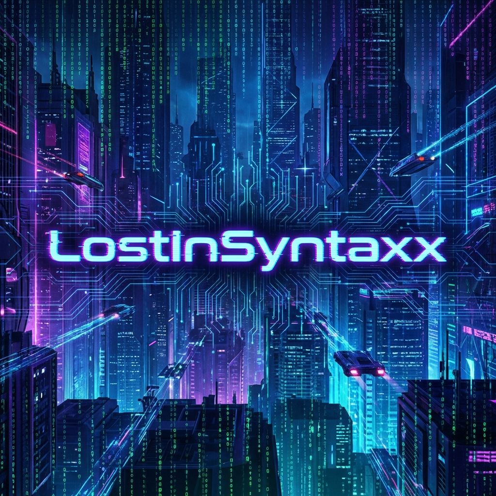

  
  
   

  

   

  

    
  

  
  

 

---

### 🚀 **Mission Protocol: About Me**

<table>
  <tr>
    <td valign="top" width="50%">
       
      💡 <b>Objective:</b> Solving complex problems with elegant, scalable solutions. 
      🔥 <b>Interests:</b> Web Development, Cyber Security, Open Source. 
       
      <b>🛠 Arsenal:</b> 
      <ul>
        <li><b>Editor:</b> <a href="https://code.visualstudio.com/">VS Code</a> (Heavily Modded)</li>
        <li><b>Power Tools:</b> <a href="https://www.jetbrains.com/webstorm/">WebStorm</a> & <a href="https://visualstudio.microsoft.com/">Visual Studio</a></li>
      </ul>
       
      <b>🎧 Neural Link (Spotify):</b> 
      
    </td>
    <td valign="center" width="50%">
      

        
      

    </td>
  </tr>
</table>

 

---

### 🛠 **Tech Stack & Mainframe**

  
  
   
  
   
  
   
  
  

 

---

### 🔥 **System Analytics (GitHub Stats)**

  <table width="100%">
    <tr>
      <td width="50%" align="center">
        
      </td>
      <td width="50%" align="center">
        
      </td>
    </tr>
  </table>
   
  

 

---

### 🏆 **Contribution Matrix 🐍**

  

 

---

### 🚀 **Deployed Projects**

  
  
  

 

---

### ✍️ **DevLogs**

- 🔹 [How to Build a Modern Dashboard with React & Tailwind](https://dev.to/lostinsyntaxx/react-tailwind-dashboard-101)
- 🔹 [JavaScript ES6 Features You Should Know](https://dev.to/lostinsyntaxx/js-es6-must-know)
- 🔹 [Next.js vs React: When to Choose What?](https://dev.to/lostinsyntaxx/nextjs-vs-react)

---

  <h3>⚡ System Status: Online</h3>

